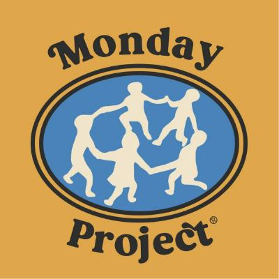

<div align="center">
  
</div>

---

## 📅 Monday 프로젝트 개요

### 서비스 소개

Monday는 관객이 사연을 쓰고 다른 관객의 사연에 공감하며, 자연스럽게 공연 예매로 이어지는 **관객참여형 양방향 콘텐츠 공간**을 지향합니다.

#### 🎪 먼데이프로젝트 Monday Project

- 웹사이트: [mondayproject.co.kr](http://mondayproject.co.kr/)
- Instagram: [@mondayprojectkr](https://www.instagram.com/mondayprojectkr/)

#### 🐾 매기스가든 Maggie's Garden

- Instagram: [@maggiesgarden_official](https://www.instagram.com/maggiesgarden_official/)

> **개발 기간**: 2026.07.29 ~ 2026.09.16

---

## 👥 프론트엔드 팀원 소개

<table align="center">
  <thead>
    <tr>
      <th>김예빈</th>
      <th>박다인</th>
      <th>이주희</th>
      <th>김나경</th>
    </tr>
  </thead>
  <tbody>
    <tr>
      <td align="center">
        
      </td>
      <td align="center">
        
      </td>
      <td align="center">
        
      </td>
      <td align="center">
        
      </td>
    </tr>
    <tr>
      <td align="center">
        <a href="https://github.com/y2bnn">@y2bnn</a>
      </td>
      <td align="center">
        <a href="https://github.com/daniswings">@daniswings</a>
      </td>
      <td align="center">
        <a href="https://github.com/jooeeh16">@jooeeh16</a>
      </td>
      <td align="center">
        <a href="https://github.com/kimnkgyeong">@kimnkgyeong</a>
      </td>
    </tr>
  </tbody>
</table>

---

## ⚙️ 기술 스택

<div align="center">
<table width="100%">
<tr>
<th align="center">Frontend</th>
<td align="left">

</td>
</tr>
<tr>
<th align="center">Styling</th>
<td align="left">

</td>
</tr>
<tr>
<th align="center">Collaboration</th>
<td align="left">

</td>
</tr>
<tr>
<th align="center">Deployment</th>
<td align="left">
추가 예정
</td>
</tr>
</table>
</div>

---

## 📁 프로젝트 구조

```text
src
├── api                     # API 요청 함수
├── assets                  # 이미지, 아이콘 등 정적 파일
│   ├── images
│   │   ├── provided        # 구글드라이브에서 받은 파일
│   │   └── custom          # 개발 과정에서 추가한 이미지
│   └── icons
├── components              # 재사용 가능한 컴포넌트
│   ├── common              # 여러 기능에서 사용하는 공통 컴포넌트
│   ├── home                # 홈 전용 컴포넌트
│   ├── performance         # 공연 안내 전용 컴포넌트
│   ├── garden              # 정원 둘러보기 및 사연 상세 전용 컴포넌트
│   ├── storyForm           # 사연 보내기 및 수정 전용 컴포넌트
│   ├── auth                # 로그인 전용 컴포넌트
│   ├── myGarden            # 내 정원 전용 컴포넌트
│   ├── mailbox             # 편지함 전용 컴포넌트
│   └── settings            # 설정 전용 컴포넌트
├── hooks                   # Custom Hook
├── pages                   # URL과 연결되는 페이지 컴포넌트
│   ├── Home
│   ├── Performance
│   ├── Garden
│   ├── StoryForm
│   ├── Login
│   ├── MyGarden
│   ├── Mailbox
│   ├── Settings
│   └── NotFound
├── router                  # React Router 설정
├── styles                  # 전역 스타일 및 공통 CSS
├── utils                   # 공통 함수 및 상수
├── App.jsx                 # 애플리케이션 최상위 컴포넌트
└── main.jsx                # React 실행 시작 파일
```

---

## 🌿 브랜치 전략 & 커밋 컨벤션

### 🌱 브랜치 구조

`develop` 브랜치를 중심으로 기능별 브랜치를 생성하여 개발합니다.

```text
main                 배포 가능한 상태
 └─ develop          개발 통합 브랜치
     ├─ feat/…       새로운 기능 개발
     ├─ fix/…        버그 수정
     └─ refactor/…   코드 리팩토링
```

### 🏷️ 브랜치 네이밍

| Prefix | 용도 | 예시 |
|:---:|---|---|
| `main` | 배포용 브랜치 | `main` |
| `develop` | 개발 통합 브랜치 | `develop` |
| `feat/` | 새로운 기능 개발 | `feat/24-settings` |
| `fix/` | 버그 수정 | `fix/faq-layout` |
| `refactor/` | 코드 리팩토링 | `refactor/story-card` |

### ✏️ 커밋 컨벤션

`{타입}: {제목}` 형식을 사용합니다.

| 타입 | 의미 |
|---|---|
| `start` | 프로젝트 초기 세팅 |
| `feat` | 새로운 기능 추가 |
| `fix` | 버그 수정 |
| `design` | UI/CSS 등 디자인 변경 |
| `refactor` | 코드 리팩토링 |
| `settings` | 설정 파일 변경 |
| `comment` | 주석 추가·변경 |
| `dependency` | 의존성/플러그인 추가 |
| `docs` | 문서 수정 |
| `merge` | 브랜치 병합 |
| `deploy` | 배포 관련 작업 |
| `rename` | 파일·폴더명 이동/수정 |
| `remove` | 파일 삭제 |
| `revert` | 이전 버전으로 롤백 |
| `test` | 테스트 코드 작성 |
